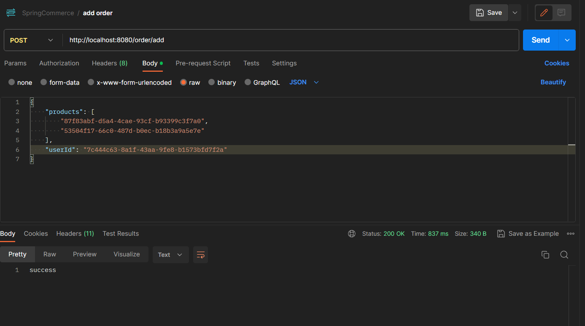

# SpringCommerce

## Problem statement
A small start-up named "SpringCommerce" wants to build a very simple online shopping application to sell their products. In order to get to the market quickly, they just want to build an MVP (Minimum Viable Product) version with a very limited set of functionalities

- [x] Entity-relationship diagram
  
1. Giải thích ngắn gọn về các nguyên tắc, mẫu phát triển phần mềm và thực tiễn đang được áp dụng.
+ Nguyên tắc sử dụng trong project: là Dependency Injection (DI) sử dụng DI thông qua các Annotation như @Autowired, @Component, @Repository, @Service, @Controller để tạo ra các đối tượng và quản lý sự phụ thuộc giữa các đối tượng này.
+ Mẫu sử dụng trong project là: Model-View-Controller (MVC) là một mô hình thiết kế phần mềm cho phép chia nhỏ ứng dụng thành các thành phần riêng biệt và độc lập nhau để dễ dàng quản lý. Trong Project, ta có thể sử dụng các Annotation @Controller, @RequestMapping, @ModelAttribute, @RequestParam để triển khai mô hình MVC.
+ Thực tiễn phát triển phần mềm là các kinh nghiệm và phương pháp đã được chứng minh hiệu quả trong quá trình phát triển phần mềm. Trong project, có thể sử dụng các kỹ thuật như Test-Driven Development (TDD) để viết các unit test và Integration test cho ứng dụng của mình.
2. Giải thích ngắn gọn cho cấu trúc mã:
- Các thư mục quan trọng bao gồm:
    + src/main/java: chứa mã nguồn Java của ứng dụng.
    + src/main/resources: chứa các tài nguyên như file cấu hình, file tĩnh, v.v.
    + src/test/java: chứa các mã nguồn kiểm thử cho ứng dụng.
    + src/test/resources: chứa các tài nguyên cần thiết cho việc kiểm thử.
    + pom.xml: chứa các thông tin về phụ thuộc và cấu hình cho dự án.
    + application.properties hoặc application.yml: chứa các cấu hình của ứng dụng, ví dụ như cấu hình kết nối cơ sở dữ liệu, cấu hình HTTP, v.v.
- Trong thư mục src/main/java, các package được tổ chức theo mô hình MVC (Model-View-Controller) hoặc theo một số mô hình khác như DAO (Data Access Object), Service, Repository, v.v gồm:
    + Model: chứa các đối tượng đại diện cho dữ liệu trong ứng dụng.
    + Templates: chứa các tệp thực hiện chức năng hiển thị giao diện người dùng.
    + Controller: chứa các lớp điều khiển để xử lý các yêu cầu từ người dùng và điều hướng đến các lớp thực hiện chức năng tương ứng.
    + Service: chứa các lớp thực hiện các chức năng xử lý logic nghiệp vụ của ứng dụng.
    + Repository: chứa các lớp thực hiện các thao tác liên quan đến cơ sở dữ liệu của ứng dụng.
3. Tất cả các bước cần thiết để chạy ứng dụng trên máy cục bộ máy tính.
   Gồm các bước sau:
+ Tạo một cơ sở dữ liệu trong MySQL để lưu trữ dữ liệu của ứng dụng.Có thể sử dụng MySQL Workbench hoặc dòng lệnh để tạo cơ sở dữ liệu.
+ Cấu hình các thông số kết nối cơ sở dữ liệu trong tệp application.properties hoặc application.yml của ứng dụng Spring Boot.
+ Chạy ứng dụng Spring Boot.

4. Table of APIs

  ---  

| URL                     | METHOD | IMAGE                                                  | DESCRIPTION                            |
  |-------------------------|:------:|--------------------------------------------------------|----------------------------------------|
| `/product/get`          |  POST  |     | Get all products                       |
| `/products/get/{id}`    |  GET   |  | Get products with id                   |
| `/products/add`         |  POST  |      | Create a new product                   |
| `/products/update/{id}` |  PUT   |   | Update a product by id                 |
| `/products/delete/{id}` | DELETE |   | Delete product by id                   |
| `/order/add`            |  POST  |        | Add a order                            |
| `/order/get`            |  GET   |    | Get all orders                         |
| `/order/update/{id}`    |  PUT   |     | Update order by id                     |
| `/order/delete/{id}`    | DELETE |     | Delete a order                         |
| `/checkout/{id}`        |  POST  |        | Check out the order                    |
| `/add-to-cart/{id}`     |  POST  |       | Add a product to cart                  |
| `/product/get?filter=?` |  POST  |          | Filter list products by name, category |

  ---